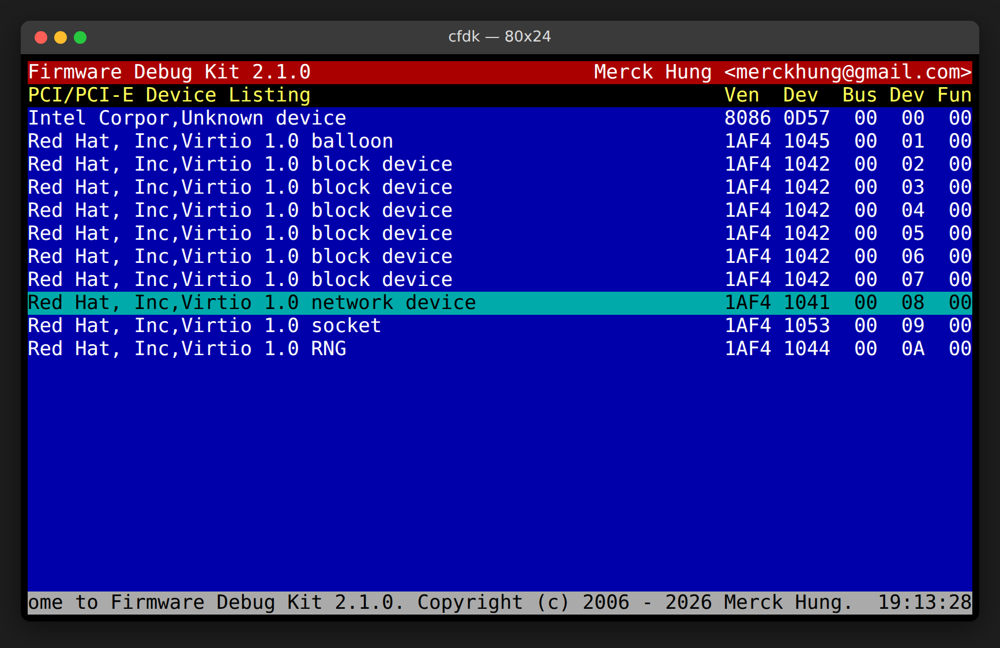
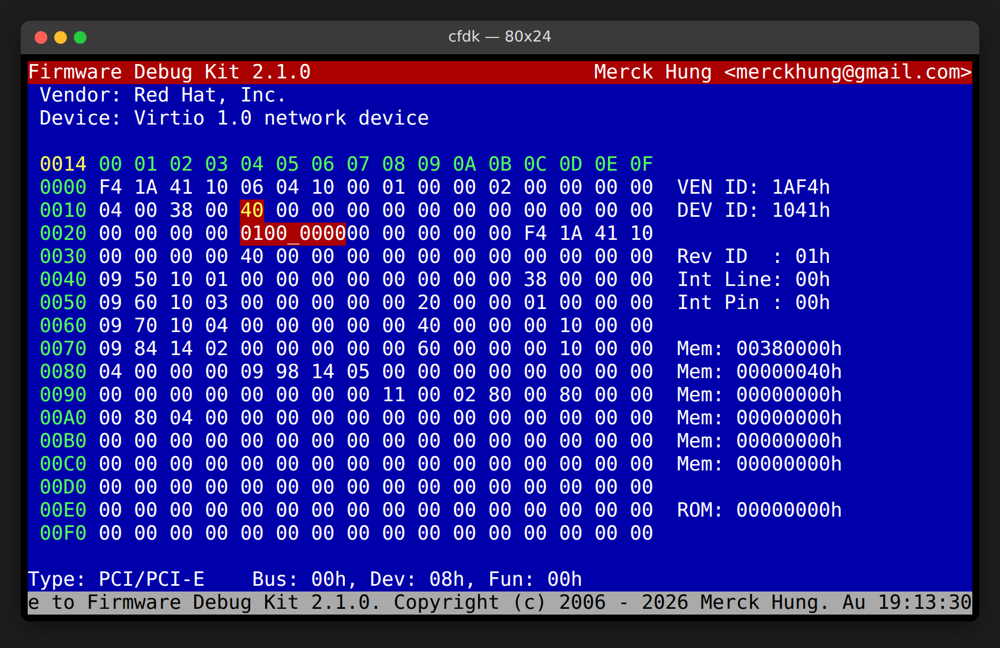
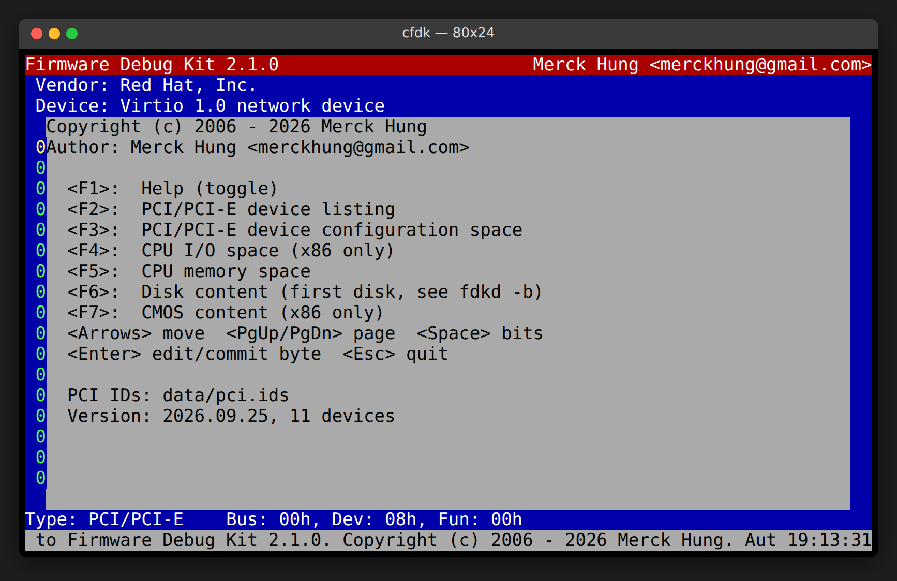
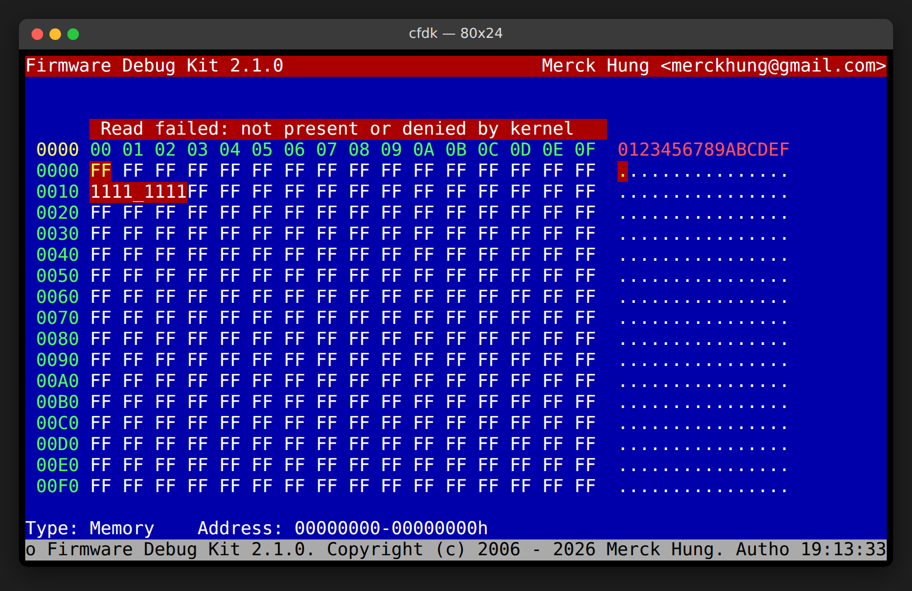

# FDK — Firmware Debug Kit

FDK is a BIOS-setup-style hardware inspector for Linux. It lets firmware and
driver developers look at (and poke) the low-level state of a running machine:

* PCI / PCI Express devices and their configuration space
* physical memory, including MMIO registers
* CPU I/O ports (x86)
* CMOS / RTC NVRAM (x86)
* raw disk sectors
* the firmware (E820) memory map

It is split into a small privileged server, `fdkd`, that runs on the machine
under test, and clients that talk to it over TCP (or a serial line): the
full-screen ncurses browser `cfdk`, and the scriptable command-line tool
`memvr`.

| PCI device listing | PCI configuration space |
| --- | --- |
|  |  |
| **Help (F1)** | **Memory view when the kernel denies access** |
|  |  |

<sub>Screenshots were taken in a cloud VM (Linux 6.18). Its kernel is built
without `CONFIG_DEVMEM` and runs in lockdown mode, so memory, I/O and CMOS
reads fail there; the last screenshot shows how `cfdk` reports that. Run
`tools/make-screenshots.sh` to regenerate them.</sub>

## Architecture

```
  +-----------------+                     +----------------------------------+
  | cfdk (ncurses)  |   TCP 7123 / UART   | fdkd (root, on the target)       |
  | memvr (CLI)     | <-----------------> |                                  |
  +-----------------+  request/response   |  memory -> /dev/mem              |
                                          |  I/O    -> /dev/port, ioperm()   |
                                          |  PCI    -> /sys/bus/pci/devices  |
                                          |  CMOS   -> ports 70h-73h         |
                                          |  disk   -> /dev/<disk>           |
                                          |  E820   -> /sys/firmware/memmap  |
                                          +----------------------------------+
```

Each request is a packed little-endian packet with an 8-byte header
(`opCode`, `errorCode`, `pktLen`) followed by an opcode-specific body; see
[`include/packet.h`](include/packet.h). The server answers every request with
the matching response opcode. Unreadable data comes back as `FFh` with
`errorCode` set, and malformed requests get `FDK_RSP_NACK`.

## Building

Requirements: a C11 compiler, GNU make, and the ncurses development package
(`libncurses-dev` on Debian/Ubuntu, `ncurses-devel` on Fedora).

```sh
make                 # builds fdkd, cfdk and memvr
sudo make install    # PREFIX=/usr/local by default; also installs pci.ids
```

| Target               | Description                                              |
| -------------------- | -------------------------------------------------------- |
| `make`               | Build all three programs                                 |
| `make install`       | Install to `$(PREFIX)` (`DESTDIR` is honoured)           |
| `make format`        | Re-format all sources with clang-format (Google style)   |
| `make check-format`  | Fail if any source is not formatted                      |
| `make update-pciids` | Download the latest PCI ID database into `data/pci.ids`  |
| `make clean`         | Remove build output                                      |

Cross compiling works as usual, e.g. `make CROSS_COMPILE=aarch64-linux-gnu-`.
On non-x86 targets the I/O port and CMOS functions report failure, and
everything else works.

## Running

### Server: `fdkd`

`fdkd` needs root (or `CAP_SYS_RAWIO` plus read access to the devices). By
default it daemonizes and listens on **127.0.0.1:7123**.

```sh
sudo fdkd -d                    # stay in the foreground, print diagnostics
sudo fdkd -l 0.0.0.0            # accept remote clients (see Security below)
sudo fdkd -b /dev/nvme0n1       # choose the disk used by the Disk view
```

| Option       | Meaning                                                            |
| ------------ | ------------------------------------------------------------------ |
| `-d`         | Don't daemonize                                                    |
| `-l address` | Listen address (IPv4, IPv6 or host name); default `127.0.0.1`      |
| `-p port`    | TCP port; default `7123`                                           |
| `-b device`  | Block device for disk requests; default is the first physical disk in `/sys/block` (`nvme0n1`, `sda`, `vda`, ...) |

At start-up `fdkd` probes the kernel and warns about each access path that is
unavailable, for example:

```
Warning: /dev/mem: No such file or directory; memory access is disabled (CONFIG_DEVMEM, lockdown?)
Disk requests use /dev/vda
```

### Full-screen client: `cfdk`

```sh
cfdk                    # connect to fdkd on localhost
cfdk -i 192.168.1.20    # or a remote target (host name / IPv6 also work)
cfdk -d /dev/ttyUSB0    # or a target speaking the protocol on a UART (115200 8N1, raw)
```

The terminal must be at least 80x24.

| Key             | Action                                              |
| --------------- | --------------------------------------------------- |
| `F1`            | Toggle help (also shows which `pci.ids` is in use)  |
| `F2`            | PCI/PCI-E device listing; `Enter` opens a device    |
| `F3`            | PCI configuration space of the selected device      |
| `F4`            | CPU I/O space (x86)                                 |
| `F5`            | Physical memory                                     |
| `F6`            | Disk sectors                                        |
| `F7`            | CMOS (256 bytes, both banks)                        |
| Arrows          | Move the cursor                                     |
| `PgUp` / `PgDn` | Previous/next 256 bytes (next/previous device on F3) |
| `Space`         | Toggle the bit view of the byte under the cursor    |
| `Enter`         | Start editing the byte; type hex digits, `Enter` writes, `Esc` cancels |
| `Esc`           | Quit                                                |

### Command-line client: `memvr`

`memvr` reads and modifies physical memory from scripts. Addresses are 64-bit
hexadecimal values with a `0x` prefix.

```sh
memvr -r 0xFED00000                 # read a 32-bit register
memvr -q -r 0xFED00000              # ... print only the value
memvr -b -r 0xFED00000              # ... and show it bit by bit
memvr -w 0xFED00010/0x00000001      # write
memvr -o 0xFED00010/0x00000100      # read-modify-write: OR
memvr -a 0xFED00010/0xFFFFFEFF      # read-modify-write: AND
memvr -d 0xF0000/0x100              # hex dump (up to 0x1000 bytes)
memvr -i target.lab -r 0x100000000  # remote target, above 4 GiB
```

## Kernel compatibility (Linux 6.x / 7.x)

FDK 2.1 accesses hardware only through the current, stable kernel
interfaces, so it works on the kernels shipped today and on the 7.x series.
Two things changed from FDK 2.0 to make that possible:

* **PCI uses sysfs** (`/sys/bus/pci/devices/*/config`) instead of poking ports
  `CF8h`/`CFCh` behind the kernel's back. This avoids races with the kernel's
  own configuration accesses. It also reaches every PCI segment/domain
  (reported in the high byte of the bus number) and works on non-x86
  machines. The legacy port mechanism remains as a fallback on x86 when sysfs
  is missing.
* **Kernel hardening is detected and reported**, not silently shown as
  garbage. Failed reads show a *Read failed* banner in `cfdk` and a
  non-zero exit status in `memvr`.

Which features work depends on how the target kernel is configured:

| Feature          | Needs                                                   | Notes |
| ---------------- | ------------------------------------------------------- | ----- |
| Memory           | `CONFIG_DEVMEM=y`                                       | With `CONFIG_STRICT_DEVMEM` (the default on most distributions) only MMIO, ROM and the first 1 MiB are readable; `CONFIG_IO_STRICT_DEVMEM` also blocks MMIO that has a driver bound. `fdkd` falls back from `mmap()` to `pread()` where the kernel allows it. Boot with `iomem=relaxed` to lift the MMIO restriction. |
| I/O ports        | `CONFIG_DEVPORT=y`, or `ioperm()` on x86                |       |
| CMOS             | as I/O ports                                            | Bank 2 (80h-FFh) uses ports 72h/73h. NMI is never masked. |
| PCI config       | sysfs (always present)                                  | Reads beyond 64 bytes need root. Conventional PCI devices have 256 bytes; the rest reads as `FFh`. |
| Disk             | read access to the block device                         | Writing to a **mounted** disk fails with `EBUSY` on kernels built without `CONFIG_BLK_DEV_WRITE_MOUNTED` (6.8+). |
| E820 map         | `CONFIG_FIRMWARE_MEMMAP=y`                              | Read from `/sys/firmware/memmap`. |
| Everything above | kernel lockdown **off**                                 | `lockdown=integrity` (default with Secure Boot on many distributions) disables `/dev/mem`, `/dev/port`, `ioperm()`/`iopl()` and PCI config *writes*. PCI listing, PCI reads, disk and E820 keep working. |

This release was built and tested on Linux 6.18 (x86-64) with gcc 13 and
clang 18.

## PCI ID database

Device names come from the [PCI ID Project](https://pci-ids.ucw.cz/)
database. A current copy (version **2026.09.25**) is bundled in
[`data/pci.ids`](data/pci.ids) and installed to `$(PREFIX)/share/fdk/pci.ids`.

At start-up `cfdk` looks at the bundled copy and the system databases
(`/usr/share/hwdata/pci.ids`, `/usr/share/misc/pci.ids`,
`/usr/share/pci.ids`), and uses whichever has the newest `Version:` header,
so an updated distribution package is used automatically. Use `-p` to force a
specific file. To refresh the bundled copy:

```sh
make update-pciids    # tries pci-ids.ucw.cz, then the GitHub mirror
```

## Security

`fdkd` gives anyone who can connect to it root-level access to memory, I/O
ports, PCI configuration space and disks. The protocol has **no
authentication or encryption**. For that reason it now listens on localhost
only by default. To debug a remote machine, prefer an SSH tunnel:

```sh
ssh -L 7123:127.0.0.1:7123 root@target 'fdkd -d'   # on your workstation
cfdk                                              # in another terminal
```

Only use `-l 0.0.0.0` on an isolated lab network.

The server validates every request against its buffer size and ignores
`SIGPIPE`, so a misbehaving client cannot crash it.

## Source layout

```
include/            Shared headers (protocol in packet.h)
lib/                Code shared by all programs: packet framing, sockets, parsing
src_fdkd/           Server: main loop and request handler
src_fdkd/linux/     Linux back-ends: libmem, libpci, libport, libdisk, libe820
src_cfdk/           ncurses client: panels, PCI name lookup, requests
src_memvr/          Command-line memory tool
data/pci.ids        Bundled PCI ID database
tools/              Screenshot tooling (tmux + Playwright)
docs/screenshots/   Images used in this README
```

The code follows the [Google C++ style guide](https://google.github.io/styleguide/cppguide.html)
formatting rules (applied to C) through [`.clang-format`](.clang-format). Run
`make format` before sending a change, and `make check-format` in CI.

## Changes in 2.1.0

* Linux 6.x/7.x: sysfs PCI access with multi-segment support; real E820 map
  from `/sys/firmware/memmap`; `/dev/port` support; configurable disk
  (NVMe/virtio) instead of hard-coded `/dev/sda`; disks opened read-only
  unless writing; start-up diagnostics for `CONFIG_DEVMEM`, lockdown, etc.
* 64-bit physical addresses in `memvr`, and memory paging in `cfdk`.
* PCI ID database updated to 2026.09.25, newest-database auto-selection, and
  `make update-pciids`. Name lookup is now a single pass over the file
  instead of re-reading it byte by byte for every device.
* Robustness and security: requests are length-checked (a client could
  previously overflow the root daemon's buffer), packets are framed so
  partial TCP reads are handled, `SIGPIPE` no longer kills the server,
  threads are detached, `SO_REUSEADDR` is set, and the server listens on
  localhost by default. IPv6 and host names are supported.
* Bug fixes: CMOS reads ignored the requested offset and size (the 256-byte
  view never worked); legacy PCI byte writes wrote the wrong value; PgUp
  skipped two screens and corrupted the device index on the PCI view; PgDn
  did nothing on the disk view; `/dev/mem` mappings used an 8 KiB page mask;
  the ncurses status bar leaked a window every second; the PCI list printed
  uninitialized buffers when no device was found; serial links were left in
  canonical (line-editing) mode; the E820 response
  length was computed from the wrong type.
* Clean-up: self-contained headers with include guards, dead code removed,
  `<stdint.h>`/`<stdbool.h>` types, Google-style formatting, a Makefile with
  dependency tracking plus `install`/`format` targets, and a `COPYING` file.

## License

Copyright (C) 2006 - 2026 Merck Hung &lt;merckhung@gmail.com&gt;

FDK is free software, licensed under the GNU General Public License
version 2; see [`COPYING`](COPYING). The bundled `data/pci.ids` is
distributed under the GPL-2.0-or-later or BSD-3-Clause license by the PCI
ID Project.
